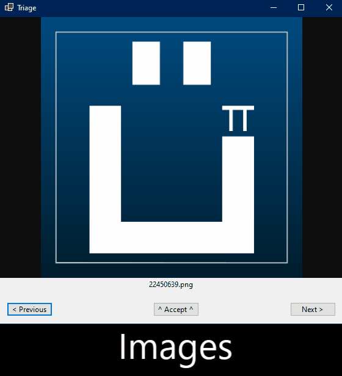

# Triage 

Ever had to sift through hundreds of files to find the good stuff? Maybe you want to find this year's best pictures to use them in a video.

Triage helps you in this process. It shows a preview of each file, and you only need to use your arrow keys:

- `>` next
- `<` previous
- `^` accept

Accepted files are copied to another folder that you choose. In the end, that folder will contain all the good stuff.

If you accepted a file by mistake, just go back and `v` reject it.

## Supported files

Triage supports many file types. It leverages Microsoft's [WebView2](https://developer.microsoft.com/en-us/Microsoft-edge/webview2/) for preview.

If a browser can display it, it will work with Triage.

## Starting file

You can specify the filename from which Triage should start. It's like a checkpoint.

Say you close the program on accident. When you re-open it, you can enter the last file name that you saw, or the last file name you accepted if you don't remember that.

Nobody likes to start from scratch.

## Filters

You can filter which kind of files you want to sift through.

The filter can be a normal filename, and can also contain wildcards (`*` and `?`). It doesn't support regex, however.

Examples: `*.png`, `grade_*.pdf`, `stuff.*`

## Does it work with subfolders?

No. Maybe in the future. Subfolders can add a lot of complexity (*e.g.* clashing file names).

Triage is made for those massive folders with thousands of files, like group chat archives.

# License 

Triage was created by [UnexomWid](https://uw.exom.dev). It is licensed under the [MIT](https://github.com/UnexomWid/triage/blob/master/LICENSE) license.